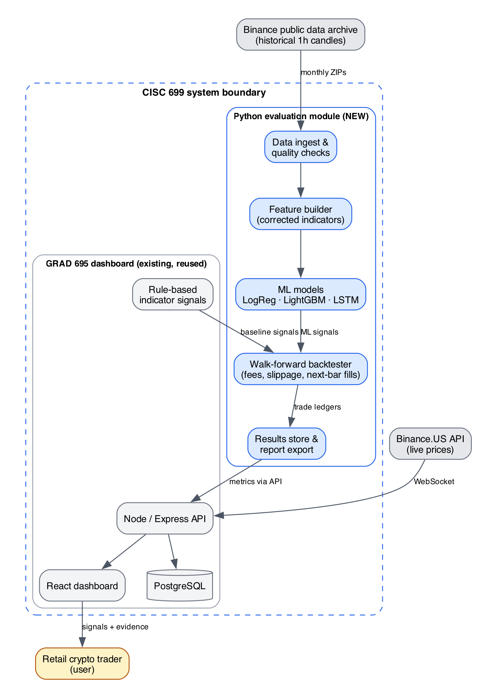

# Trustworthy Crypto Trading Signals

CISC 699 Applied Project (Fall 2026), Harrisburg University — Ajinkya Deshmukh

My GRAD 695 dashboard shows BUY / SELL / HOLD signals for BTC, ETH, SOL and ADA, but gives no evidence of how those signals performed in the past. This project extends it in two stages:

1. **Trust** — fix the indicators (the MACD signal line is currently wrong) and replay the rule-based signals on historical data with realistic fees, slippage and next-candle execution.
2. **Improve** — train ML signal models (logistic regression, LightGBM, LSTM as a stretch goal) with walk-forward evaluation and test whether they beat the rules, buy-and-hold, and a moving-average crossover.

Scope: BTC/USDT and ETH/USDT, 1-hour candles, 2020–2026, from the Binance public data archive. Simulation only — no live trading.

## Success criteria

| # | Criterion | Threshold |
|---|---|---|
| 1 | Beats simple alternatives | Higher Sharpe after fees than buy-and-hold and MA crossover on the held-out period |
| 2 | Limits bad stretches | Max drawdown ≥ 25% smaller than buy-and-hold |
| 3 | Better than a coin flip | ≥ 53% directional accuracy on unseen data |
| 4 | Holds up | Held-out Sharpe ≥ ½ development Sharpe; positive at 2× costs; identical reruns |

## Repository layout

```
baseline/crypto-dashboard/   GRAD 695 dashboard (prior work, preserved with checksums)
evaluation/                  NEW Python module: data, features, models, backtester
src/crypto_eval/             Run-configuration validator (Node)
config/                      Run configurations
docs/                        Architecture, environment, backlog, engineering log, diagrams
evidence/                    Saved output from checks
```



## Quick start (evaluation module)

```sh
cd evaluation
python3.13 -m venv .venv && source .venv/bin/activate
pip install -r requirements.txt
python -m signal_eval.data BTCUSDT 2024-01   # download one month + quality report
python -m pytest -q
```

## Status

Week 1: workspace, data access verified (Jan 2024 BTC/ETH: 744 candles each, no gaps), starter tests passing. Work is tracked in [Issues](../../issues) by hard stop.

## Prior work and AI use

`baseline/` is my own GRAD 695 project (see `baseline/BASELINE_PROVENANCE.md`). AI assistance (OpenAI Codex, Anthropic Claude) is disclosed in each course submission's AI usage log and in `docs/ENGINEERING_LOG.md`.

*Educational project. Not investment advice.*
