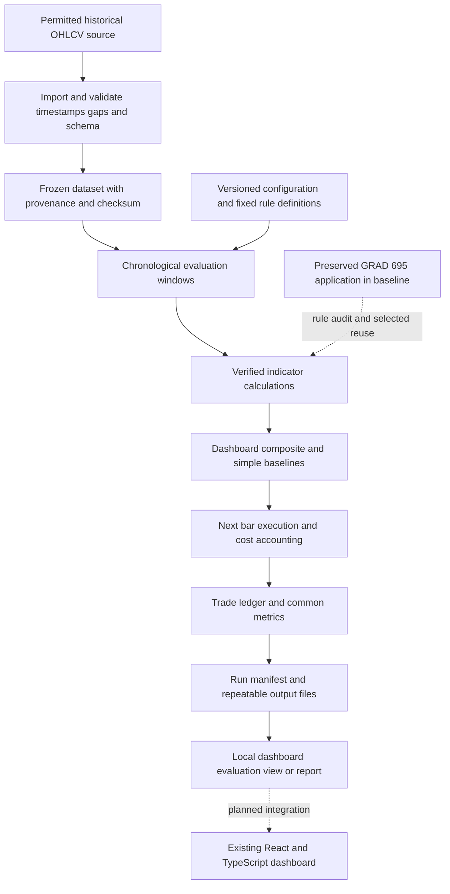

# Workspace architecture and proposed evaluation

The workspace separates the preserved GRAD 695 application in `baseline/crypto-dashboard/` from the new CISC 699 configuration validator in `src/crypto_eval/`. The baseline provides frontend, backend, database schema, tests and configuration for reuse. The historical evaluation pipeline below is proposed; copying the application does not implement that pipeline or establish a running service.

## Component boundaries

The importer will reject or report malformed records, duplicate timestamps, missing intervals, and inconsistent ordering. A frozen dataset will retain its source, retrieval date, interval, coverage, schema, and content hash. Access rights and redistribution permissions still require verification.

The evaluator will consume immutable candles and versioned rule definitions. At each decision point it may see only completed candles. A signal calculated at a candle close will be eligible for execution at the following candle's open under the proposed simulation convention. Treatment of gaps and a final signal without a following bar must be specified before implementation.

All three strategies will use the same periods, available capital, execution conventions, and explicit costs. Buy and hold must include its own entry and exit costs under the selected accounting rules. Indicator warm-up periods and the common evaluation start must be fixed to prevent unequal comparisons.

The ledger will preserve the timestamp, side, quantity, gross price, slippage, fee, cash balance, and position after every simulated fill. Metrics will be derived from that ledger and marked-to-market equity. Repeated runs with the same inputs must produce the same result content, apart from explicitly excluded metadata such as the run timestamp.

The dashboard integration is downstream of a verified evaluation core. It must distinguish historical simulated results from the older application's live market display. It does not connect this module to order placement.

## Existing and new work

The baseline directory holds the current local GRAD 695 working tree after filtering generated dependencies, runtime data and private configuration. Its React and TypeScript interface, Node and Express services, PostgreSQL schema, indicator code, tests and deployment configuration are existing work. The original `/Users/ajink/crypto-dashboard` remains separate. See `baseline/BASELINE_PROVENANCE.md` and `baseline/BASELINE_SHA256SUMS.txt` for the copy boundary and file identity evidence. This is not evidence of the exact version previously submitted for GRAD 695.

The new CISC 699 code currently validates a proposal JSON configuration. It has no dependency on the copied app's frontend or backend packages. The baseline and the new validator have separate package manifests; their presence does not show that a combined application has been built or run.

The existing MACD signal-line issue is preserved in the baseline: the calculation passes one MACD observation to a nine-period EMA and falls back to zero. The evaluator must use a separately documented, verified rule definition. Do not silently change the preserved snapshot or treat the old indicator tests as numerical validation of the new evaluator.

Proposed CISC 699 work: numerical verification of indicator rules, causal historical replay, comparable execution and transaction-cost accounting, simpler baselines, chronological evaluation, a run manifest, and a results interface. These components remain to be implemented and evaluated.

## Decisions pending

- Confirm BTCUSD and one-hour candles after checking historical coverage.
- Freeze corrected rule definitions separately from any reproduction of the original dashboard behavior.
- Select evaluation periods and any permitted parameter-selection period before viewing held-out results.
- Fix position sizing, treatment of missing candles, fee scenarios, and slippage assumptions.
- Confirm whether a local exported report satisfies the artifact requirement or whether a dashboard screen is mandatory.
